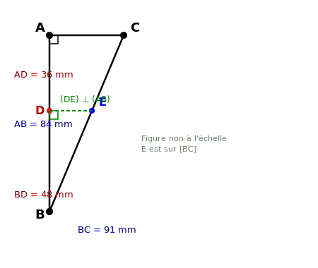
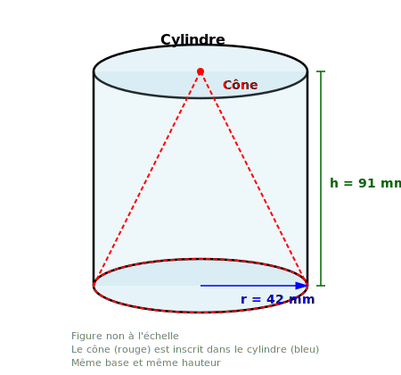
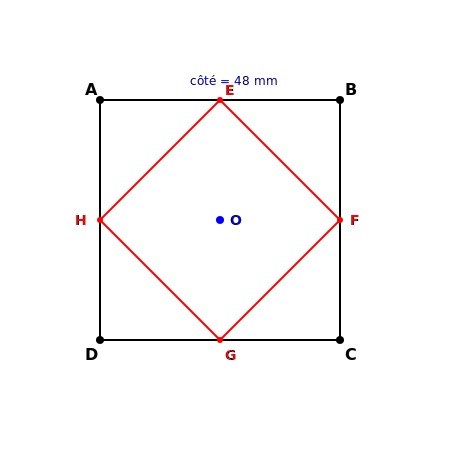

# Contrôle des connaissances de mathématiques
## Classes de 4ème

**Durée de l'épreuve : 2 heures**

*La calculatrice n'est pas autorisée.*
*La présentation devra être soignée et les résultats soulignés.*

---

## ALGÈBRE (10 points)

### Exercice 1 : Calcul numérique (4 points)

**1.** Calculer A, B et C et donner chaque résultat sous forme de fraction irréductible :

$$A = \frac{5}{7} - \frac{3}{11} \times \frac{22}{9}$$

$$B = \left(\frac{4}{13} + \frac{7}{26}\right) \div \frac{3}{52}$$

$$C = \frac{-\frac{8}{3} + \frac{5}{6}}{\frac{7}{9} - \frac{2}{3}}$$

**2.** Donner l'écriture scientifique du nombre suivant :

$$D = \frac{42 \times 10^{-7} \times 8,4 \times (10^3)^2}{5,6 \times 10^{-5} \times 3 \times 10^{11}}$$

---

### Exercice 2 : Calcul littéral (3,5 points)

**a)** Développer et réduire l'expression suivante :

$$E = (3x - 7)(2x + 5) - (x - 4)(x + 9)$$

**b)** Calculer E pour x = -3.

**c)** Factoriser au maximum les expressions suivantes :

$$F = (2x + 7)(5x - 3) + (2x + 7)(x + 8)$$

$$G = 16x^2 - 49$$

---

### Exercice 3 : Équations (2,5 points)

Résoudre les équations suivantes :

**a)** $5(x - 3) - 2(3x + 7) = 4x - 11$

**b)** $\frac{2x - 1}{3} - \frac{x + 5}{4} = \frac{1}{6}$

---

## GÉOMÉTRIE (10 points)

### Exercice 4 : Théorème de Pythagore (3 points)

Sur la figure ci-dessous, qui n'est pas à l'échelle, ABC est un triangle rectangle en A tel que AB = 84 mm et BC = 91 mm.
Le point D est sur [AB] tel que AD = 36 mm.
La droite passant par D et perpendiculaire à (AB) coupe [BC] en E.

**1.** Calculer AC. Justifier.

**2.** Calculer BE. Justifier.

**3.** Le triangle BDE est-il rectangle ? Justifier.

---

### Exercice 5 : Théorème de Thalès (3,5 points)

On considère la figure ci-dessous où les points M, A, T sont alignés ainsi que les points M, H, R.
On donne : MA = 42 mm ; MT = 63 mm ; MH = 56 mm ; MR = 84 mm ; AT = 21 mm.

**1.** Montrer que les droites (AH) et (TR) sont parallèles.

**2.** Calculer AH.

**3.** Calculer l'aire du triangle MAH.

---

### Exercice 6 : Aires et transformations (3,5 points)

ABCD est un carré de côté 48 mm.
Les points E, F, G et H sont les milieux respectifs des côtés [AB], [BC], [CD] et [DA].

**1.** Quelle est la nature du quadrilatère EFGH ? Justifier.

**2.** Calculer l'aire du carré ABCD.

**3.** Calculer l'aire du quadrilatère EFGH.

**4.** On effectue une symétrie centrale de centre O (centre du carré ABCD) qui transforme le point A en A'.
Placer le point A' et calculer la distance AA'.
