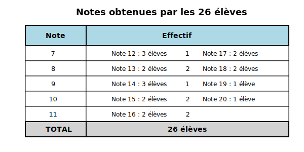
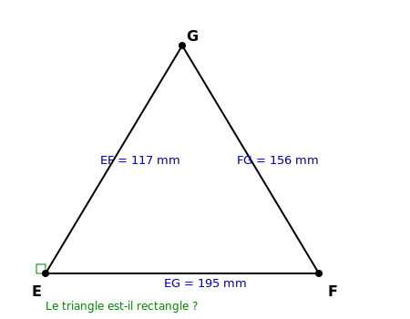
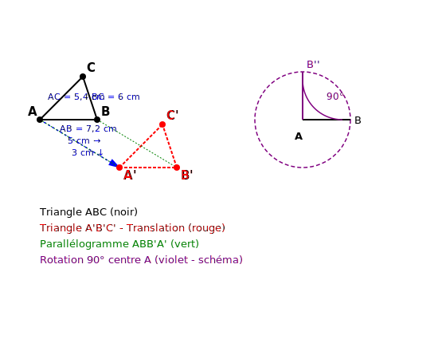

# Contrôle des connaissances de mathématiques
## Classes de 4ème

**Durée de l'épreuve : 2 heures**

*La calculatrice n'est pas autorisée.*
*La présentation devra être soignée et les résultats soulignés.*

---

## ALGÈBRE (10 points)

### Exercice 1 : Calcul numérique (3,5 points)

**1.** Calculer A et B et donner chaque résultat sous forme de fraction irréductible :

$$A = -\frac{7}{13} + \frac{5}{26} \times \frac{-39}{15}$$

$$B = \left(\frac{-11}{17} - \frac{8}{51}\right) : \frac{-35}{102}$$

**2.** Écrire C sous la forme d'une puissance de 3 :

$$C = \frac{(-3)^5 \times (3^{-2})^4}{(-3)^{-3} \times 3^7}$$

**3.** Donner l'écriture décimale du nombre D :

$$D = 3,7 \times 10^{-4} - 8,2 \times 10^{-5}$$

**4.** Donner l'écriture scientifique du nombre E :

$$E = \frac{6,3 \times 10^{-8} \times 1,4 \times 10^{13}}{2,1 \times 10^7}$$

---

### Exercice 2 : Calcul littéral et factorisation (4 points)

**a)** Développer, réduire et ordonner l'expression suivante :

$$F = (5x - 8)(3x - 2) - (2x - 3)^2$$

**b)** Calculer F pour $x = -\frac{1}{3}$.

**c)** Factoriser au maximum les expressions suivantes :

$$G = (7x - 3)(2x + 5) - (2x + 5)^2$$

$$H = 81x^2 - 64$$

$$K = 9x^2 + 42x + 49$$

---

### Exercice 3 : Problème de proportionnalité (2,5 points)

Un automobiliste parcourt 357 km en consommant 23,8 litres d'essence.

**a)** Combien de kilomètres peut-il parcourir avec 17 litres d'essence ? (Arrondir au km près)

**b)** Il souhaite parcourir 520 km. Quelle quantité d'essence (en L) lui sera nécessaire ? (Arrondir au dixième de litre près)

**c)** Le prix du litre d'essence est de 1,87 €. Calculer le montant de la dépense pour parcourir 520 km. (Arrondir au centime d'euro près)

---

## GÉOMÉTRIE (10 points)

### Exercice 4 : Statistiques (3,5 points)

Le tableau ci-dessous présente les notes obtenues par les 26 élèves d'une classe de 4ème lors d'un contrôle de mathématiques :

**1.** Calculer la note moyenne de la classe. Arrondir au dixième.

**2.** Déterminer la note médiane de cette série.

**3.** Calculer l'étendue de cette série de notes.

**4.** Quel pourcentage d'élèves a obtenu une note supérieure ou égale à 12 ?

---

### Exercice 5 : Théorème de Pythagore (3 points)

EFG est un triangle tel que EF = 117 mm, FG = 156 mm et EG = 195 mm.

**1.** Ce triangle est-il rectangle ? Justifier par un calcul.

**2.** Si oui, préciser en quel sommet.

**3.** Calculer l'aire de ce triangle.

---

### Exercice 6 : Transformations géométriques (3,5 points)

On considère un triangle ABC tel que AB = 7,2 cm, AC = 5,4 cm et BC = 6 cm.

**1.** Construire l'image A'B'C' du triangle ABC par la translation qui transforme A en un point A' situé 5 cm à droite et 3 cm en bas de A.

**2.** Quelle est la nature du quadrilatère ABB'A' ? Justifier.

**3.** Calculer le périmètre du quadrilatère ABB'A'.

**4.** On effectue maintenant une rotation de centre A et d'angle 90° dans le sens antihoraire qui transforme le triangle ABC en A''B''C''.

Tracer le triangle A''B''C''. Que peut-on dire des segments [AB] et [AB''] ?
