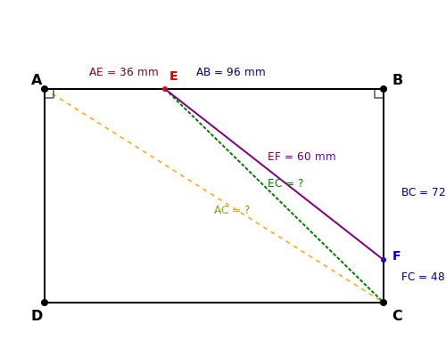
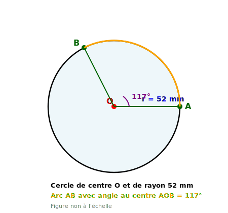
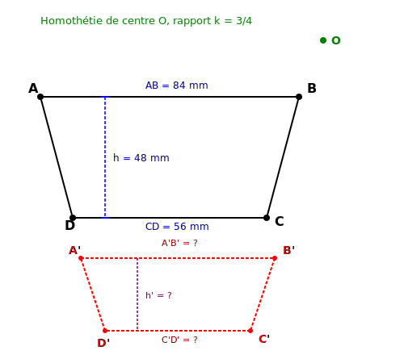

# Contrôle des connaissances de mathématiques
## Classes de 4ème

**Durée de l'épreuve : 2 heures**

*La calculatrice n'est pas autorisée.*
*La présentation devra être soignée et les résultats soulignés.*

---

## TRAVAUX NUMÉRIQUES (10 points)

### Exercice 1 : Calculs et puissances (4,5 points)

**1.** Calculer A, B et C et donner chaque résultat sous forme de fraction irréductible :

$$A = \frac{5}{8} \times \frac{-12}{35} + \frac{7}{14}$$

$$B = \frac{\frac{9}{7} - \frac{5}{21}}{\frac{11}{6} + \frac{8}{9}}$$

$$C = \left(1 - \frac{5}{13}\right) : \left(\frac{7}{26} - \frac{3}{4}\right)$$

**2.** Écrire D sous la forme $a \times 10^n$ où $1 \leq a < 10$ et $n$ est un entier relatif :

$$D = \frac{5,6 \times (10^{-3})^2 \times 9 \times 10^7}{1,4 \times 10^{-4}}$$

**3.** Écrire E sous la forme d'une puissance de 2 :

$$E = \frac{2^{-5} \times (2^3)^{-2} \times 2^{13}}{2^{-7}}$$

---

### Exercice 2 : Calcul littéral (3 points)

**a)** Développer et réduire :

$$F = (4x - 9)(x + 7) + (3x - 5)(2x - 1)$$

**b)** Factoriser au maximum :

$$G = (x + 6)(5x - 2) - (5x - 2)(3x - 7)$$

$$H = 25x^2 - 30x + 9$$

$$K = (2x + 3)^2 - 49$$

---

### Exercice 3 : Équations et problème (2,5 points)

**1.** Résoudre l'équation : $\frac{3x + 7}{5} - \frac{2x - 3}{4} = \frac{x + 1}{2}$

**2.** Marie a 38 ans. Elle a 7 ans de plus que le double de l'âge de son fils Léo.

Quel est l'âge de Léo ?

---

## GÉOMÉTRIE (10 points)

### Exercice 4 : Théorème de Pythagore et applications (4 points)

ABCD est un rectangle tel que AB = 96 mm et BC = 72 mm.

E est un point du segment [AB] tel que AE = 36 mm.

**1.** Calculer la longueur de la diagonale AC du rectangle. Justifier.

**2.** Calculer EC. Justifier.

**3.** Le point F est sur le segment [BC] tel que EF = 60 mm et FC = 48 mm.

Démontrer que le triangle EFC est rectangle. Préciser en quel sommet.

**4.** Calculer l'aire du triangle AEC.

---

### Exercice 5 : Théorème de Thalès (3 points)

Sur la figure ci-dessous (non à l'échelle), les droites (MN) et (PQ) sont parallèles.

On donne : OM = 52 mm ; ON = 39 mm ; OP = 117 mm ; MN = 64 mm.

**1.** Calculer OQ. Justifier.

**2.** Calculer PQ. Justifier.

**3.** Les points M, O et P sont-ils alignés ? Justifier votre réponse.

---

### Exercice 6 : Aires et transformations (3 points)

On considère un trapèze ABCD tel que :
- (AB) // (CD)
- AB = 84 mm
- CD = 56 mm
- La hauteur h du trapèze (distance entre les droites (AB) et (CD)) est de 48 mm

**1.** Calculer l'aire du trapèze ABCD.

**2.** On effectue une homothétie de centre O (un point quelconque) et de rapport $\frac{3}{4}$ qui transforme le trapèze ABCD en trapèze A'B'C'D'.

Calculer A'B', C'D' et la hauteur h' du trapèze A'B'C'D'.

**3.** Calculer l'aire du trapèze A'B'C'D'.

Quel est le rapport entre l'aire de A'B'C'D' et l'aire de ABCD ?
