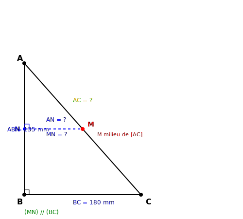
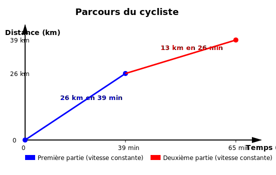
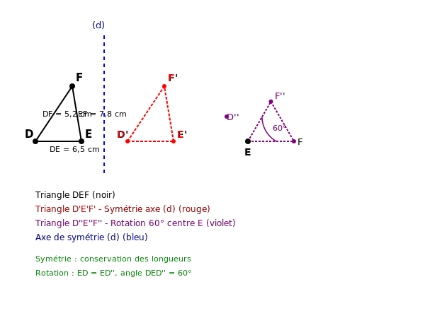

# Contrôle des connaissances de mathématiques
## Classes de 4ème

**Durée de l'épreuve : 2 heures**

*La calculatrice n'est pas autorisée.*
*La présentation devra être soignée et les résultats soulignés.*

---

## TRAVAUX NUMÉRIQUES (10 points)

### Exercice 1 : Fractions et puissances (4 points)

**1.** Calculer A et B et donner chaque résultat sous forme de fraction irréductible :

$$A = -\frac{9}{14} + \frac{5}{7} \times \frac{-21}{15}$$

$$B = \frac{3}{11} : \left(\frac{8}{33} - \frac{5}{6}\right)$$

**2.** Calculer C et donner le résultat sous la forme $2^n$ où $n$ est un entier relatif :

$$C = \frac{(2^{-3})^4 \times 2^{17}}{2^{-5} \times (2^2)^3}$$

**3.** Donner l'écriture scientifique du nombre :

$$D = \frac{7,2 \times 10^{-9} \times 8,5 \times (10^4)^2}{1,7 \times 10^{-6}}$$

---

### Exercice 2 : Développement et factorisation (3,5 points)

**a)** Développer et réduire :

$$E = (7x - 5)^2 - (3x + 4)(2x - 9)$$

**b)** Factoriser au maximum :

$$F = (4x - 7)(6x + 1) + (4x - 7)(x - 11)$$

$$G = 121x^2 - 36$$

$$H = 4x^2 - 28x + 49$$

---

### Exercice 3 : Problème avec équation (2,5 points)

Dans un magasin, un panier contient des pommes et des poires.

Il y a 156 fruits au total. Le nombre de pommes est égal au triple du nombre de poires, augmenté de 12.

**1.** On note $x$ le nombre de poires. Exprimer le nombre de pommes en fonction de $x$.

**2.** Mettre le problème en équation et résoudre cette équation.

**3.** Combien y a-t-il de pommes et de poires dans le panier ?

---

## GÉOMÉTRIE (10 points)

### Exercice 4 : Pythagore et calculs d'aires (4 points)

On considère un triangle ABC rectangle en B tel que AB = 135 mm et BC = 180 mm.

Le point M est le milieu du segment [AC].

**1.** Calculer AC. Justifier.

**2.** Calculer AM.

**3.** La parallèle à (BC) passant par M coupe [AB] en N.

Démontrer que les droites (MN) et (BC) sont parallèles, puis calculer AN et MN.

**4.** Calculer l'aire du triangle AMN.

---

### Exercice 5 : Vitesse et distance (3,5 points)

Un cycliste parcourt une distance lors d'une course contre la montre.

**1.** Durant les 39 premières minutes, il parcourt 26 km à vitesse constante. Calculer sa vitesse en km/h. Arrondir au dixième.

**2.** Il ralentit ensuite et parcourt les 13 km suivants en 26 minutes à vitesse constante. Calculer sa nouvelle vitesse en km/h. Arrondir au dixième.

**3.** Calculer sa vitesse moyenne sur l'ensemble du parcours (39 km en 65 minutes). Arrondir au dixième.

---

### Exercice 6 : Transformations géométriques (2,5 points)

On considère un triangle DEF tel que DE = 6,5 cm, EF = 7,8 cm et DF = 5,2 cm.

**1.** On effectue une symétrie axiale d'axe (d) qui transforme le triangle DEF en triangle D'E'F'.

Quelles sont les longueurs des côtés du triangle D'E'F' ? Justifier.

**2.** On effectue maintenant une rotation de centre E et d'angle 60° dans le sens horaire qui transforme D en D'' et F en F''.

a) Que peut-on dire des longueurs ED et ED'' ? Justifier.

b) Quelle est la mesure de l'angle $\widehat{DED''}$ ? Justifier.

**3.** Le quadrilatère DEE'D' (où E' est l'image de E par la symétrie d'axe (d) passant par E) est-il un parallélogramme ? Justifier.
