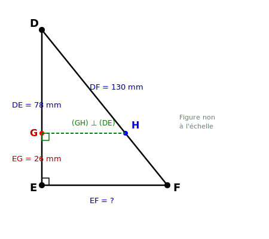
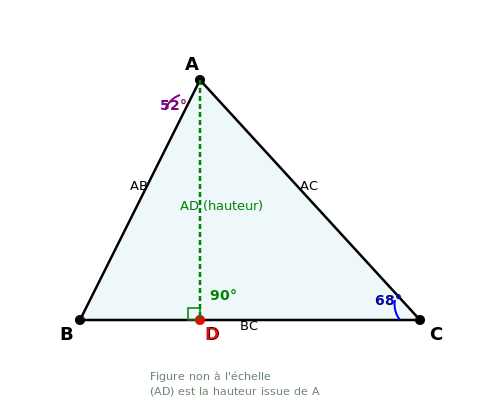
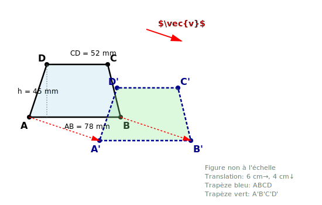

# Contrôle des connaissances de mathématiques
## Classes de 4ème - Examen 5

**Durée de l'épreuve : 2 heures**

*La calculatrice n'est pas autorisée.*
*La présentation devra être soignée et les résultats soulignés.*

---

## ALGÈBRE (10 points)

### Exercice 1 : Calcul numérique (4 points)

**1.** Calculer A, B et C et donner chaque résultat sous forme de fraction irréductible :

$$A = \frac{8}{17} - \frac{3}{34} + \frac{5}{51}$$

$$B = \left(\frac{7}{13} - \frac{4}{26}\right) \times \frac{39}{35}$$

$$C = \frac{\frac{11}{6} - \frac{7}{8}}{\frac{5}{12} + \frac{9}{16}}$$

**2.** Donner l'écriture scientifique du nombre suivant :

$$D = \frac{6,4 \times 10^{-5} \times 4,2 \times (10^{-2})^3}{3,2 \times 10^{-11}}$$

---

### Exercice 2 : Calcul littéral (3,5 points)

**a)** Développer et réduire l'expression suivante :

$$E = (5x - 8)(3x + 7) - (4x - 9)^2$$

**b)** Calculer E pour $x = \frac{2}{3}$.

**c)** Factoriser au maximum les expressions suivantes :

$$F = (3x - 4)(7x + 2) - (7x + 2)(x - 11)$$

$$G = 49x^2 - 16$$

$$H = 9x^2 - 48x + 64$$

---

### Exercice 3 : Équations et problème (2,5 points)

**1.** Résoudre l'équation suivante :

$$\frac{4x - 3}{5} - \frac{2x + 7}{3} = \frac{x - 1}{15}$$

**2.** Un rectangle a pour longueur le triple de sa largeur augmenté de 4 cm. Son périmètre est de 104 cm.
Déterminer les dimensions de ce rectangle.

---

## GÉOMÉTRIE (10 points)

### Exercice 4 : Théorème de Pythagore (3 points)

Sur la figure ci-dessous, qui n'est pas à l'échelle, DEF est un triangle rectangle en E tel que DE = 78 mm et DF = 130 mm.
Le point G est sur [DE] tel que EG = 26 mm.
La droite perpendiculaire à (DE) passant par G coupe [DF] en H.

**1.** Calculer EF. Justifier.

**2.** Calculer GH. Justifier.

**3.** Calculer l'aire du triangle DGH.

---

### Exercice 5 : Angles dans un triangle (3,5 points)

Sur la figure ci-dessous, ABC est un triangle.
Le point D est sur le segment [BC] tel que (AD) est la hauteur issue de A.

On donne : $\widehat{BAD} = 52°$ et $\widehat{ADB} = 90°$ (car AD est une hauteur).

**1.** Calculer la mesure de l'angle $\widehat{ABD}$. Justifier.

**2.** Sachant que $\widehat{ACB} = 68°$, calculer la mesure de l'angle $\widehat{BAC}$.

**3.** En déduire la mesure de l'angle $\widehat{CAD}$.

---

### Exercice 6 : Translation et aires (3,5 points)

ABCD est un trapèze de bases AB = 78 mm et CD = 52 mm, et de hauteur h = 45 mm.
On construit le trapèze A'B'C'D' par la translation de vecteur $\vec{v}$ (représenté par une flèche de 6 cm vers la droite et 4 cm vers le bas).

**1.** Calculer l'aire du trapèze ABCD.

**2.** Quelle est la nature du quadrilatère ABB'A' ? Justifier.

**3.** Calculer le périmètre de ABB'A' sachant que AB = 78 mm et que la translation est définie par un déplacement de 6 cm horizontalement et 4 cm verticalement.

**4.** Calculer l'aire de la zone commune aux deux trapèzes (si elle existe).
