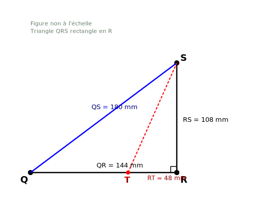
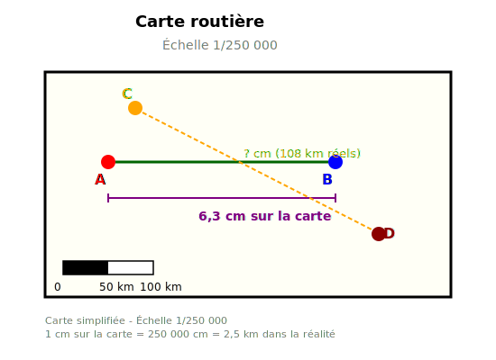
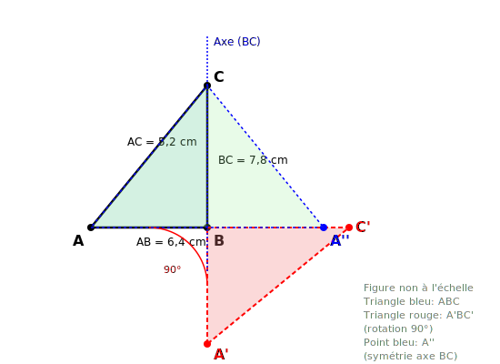

# Contrôle des connaissances de mathématiques
## Classes de 4ème - Examen 6

**Durée de l'épreuve : 2 heures**

*La calculatrice n'est pas autorisée.*
*La présentation devra être soignée et les résultats soulignés.*

---

## ALGÈBRE (10 points)

### Exercice 1 : Calcul numérique (3,5 points)

**1.** Calculer A et B et donner chaque résultat sous forme de fraction irréductible :

$$A = \frac{11}{26} + \frac{5}{39} - \frac{7}{52}$$

$$B = \left(\frac{9}{17} + \frac{2}{51}\right) : \frac{13}{34}$$

**2.** Donner le résultat sous forme d'une puissance de 5 :

$$C = \frac{5^7 \times (5^{-2})^3}{5^{-4} \times 5^5}$$

**3.** Écrire en notation scientifique :

$$D = \frac{8,1 \times 10^{-7} \times 1,6 \times (10^4)^2}{2,7 \times 10^{-3}}$$

---

### Exercice 2 : Calcul littéral (4 points)

**a)** Développer et réduire :

$$E = (6x - 5)^2 - (2x + 3)(4x - 7)$$

**b)** Factoriser au maximum les expressions suivantes :

$$F = (5x + 8)(3x - 4) + (3x - 4)(2x - 9)$$

$$G = 64x^2 - 25$$

$$H = 16x^2 + 56x + 49$$

**c)** Factoriser en utilisant deux méthodes différentes :

$$K = (3x - 7)^2 - 36$$

---

### Exercice 3 : Problème de proportionnalité (2,5 points)

Un agriculteur utilise 26 kg d'engrais pour fertiliser 312 m² de terrain.

**a)** Quelle surface peut-il fertiliser avec 17 kg d'engrais ?

**b)** Quelle quantité d'engrais lui faut-il pour fertiliser 540 m² ?

**c)** Le prix de l'engrais est de 3,70 € le kilogramme. Calculer le coût total pour fertiliser 540 m².

---

## GÉOMÉTRIE (10 points)

### Exercice 4 : Théorème de Pythagore (3 points)

Sur la figure ci-dessous, on donne : QR = 144 mm ; RS = 108 mm ; QS = 180 mm.

**1.** Le triangle QRS est-il rectangle ? Si oui, préciser en quel sommet. Justifier.

**2.** Calculer l'aire du triangle QRS.

**3.** On construit le point T sur [QR] tel que RT = 48 mm. Calculer l'aire du triangle RST.

---

### Exercice 5 : Échelle et agrandissement (3,5 points)

Sur une carte routière à l'échelle $\frac{1}{250000}$, la distance entre deux villes A et B mesure 6,3 cm.

**1.** Calculer la distance réelle en kilomètres entre les deux villes A et B.

**2.** Sur la même carte, deux autres villes C et D sont distantes de 108 km dans la réalité. Quelle est leur distance sur la carte en cm ?

**3.** On agrandit la carte avec un rapport d'agrandissement de 1,44. Quelle est la nouvelle échelle de la carte agrandie ?

---

### Exercice 6 : Transformations géométriques (3,5 points)

ABC est un triangle tel que AB = 6,4 cm, BC = 7,8 cm et AC = 5,2 cm.

**1.** On effectue une rotation de centre B et d'angle 90° dans le sens horaire qui transforme le triangle ABC en triangle A'BC'.

**a)** Quelles sont les longueurs BA' et BC' ?

**b)** Quel est l'angle $\widehat{ABA'}$ ?

**2.** On effectue une symétrie axiale d'axe (BC) qui transforme le point A en A''.

**a)** Quelle est la longueur A''B ?

**b)** Quelle est la nature du quadrilatère ABA''C ? Justifier.

**3.** Calculer le périmètre du triangle ABC.
