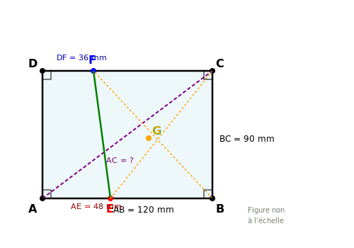
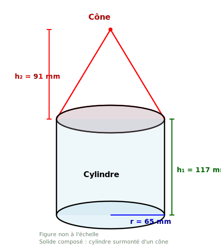
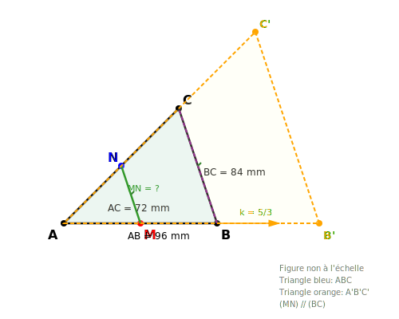

pour # Contrôle des connaissances de mathématiques
## Classes de 4ème - Examen 7 (NIVEAU DIFFICILE)

**Durée de l'épreuve : 2 heures**

*La calculatrice n'est pas autorisée.*
*La présentation devra être soignée et les résultats soulignés.*

---

## ALGÈBRE (10 points)

### Exercice 1 : Calcul numérique (4 points)

**1.** Calculer A et B et donner chaque résultat sous forme de fraction irréductible :

$$A = \frac{\frac{11}{17} - \frac{5}{34}}{\frac{7}{51} + \frac{13}{68}} + \frac{9}{26}$$

$$B = \left(\frac{8}{13} - \frac{5}{39}\right) \times \frac{-21}{35} \div \left(\frac{4}{7} - \frac{11}{14}\right)$$

**2.** Calculer C et donner le résultat sous forme d'une puissance de 7 :

$$C = \frac{7^{-3} \times (7^2)^{-4} \times (7^{-1})^5}{(7^{-2})^{-3} \times 7^{-8}}$$

**3.** Donner l'écriture scientifique :

$$D = \frac{4,8 \times 10^{-9} \times (2,5 \times 10^{-4})^2 \times 1,6 \times 10^{17}}{3,2 \times 10^{-7} \times 5 \times 10^{-6}}$$

---

### Exercice 2 : Calcul littéral (3 points)

**a)** Développer et réduire :

$$E = (3x - 5)^2 - (2x + 3)^2 + (x - 7)(5x + 4)$$

**b)** Factoriser au maximum :

$$F = (4x - 9)^2 - (2x + 7)^2$$

$$G = 9x^2 - 66x + 121$$

$$H = (5x - 3)(2x + 7) - (5x - 3)^2 + 25x^2 - 9$$

---

### Exercice 3 : Système d'équations à deux inconnues (3 points)

Léa assiste à un championnat de motocross. Sur le parking, elle compte 87 véhicules (voitures et motos).
Elle observe ensuite les roues et compte 258 roues au total.

**1.** En notant $x$ le nombre de voitures et $y$ le nombre de motos, écrire un système de deux équations à deux inconnues traduisant cette situation.

**2.** Résoudre ce système et déterminer le nombre de voitures et le nombre de motos présentes sur le parking.

---

## GÉOMÉTRIE (10 points)

### Exercice 4 : Pythagore et Thalès combinés (4 points)

Sur la figure ci-dessous, ABCD est un rectangle tel que AB = 120 mm et BC = 90 mm.
Les points E et F sont sur [AB] et [CD] respectivement, avec AE = 48 mm et DF = 36 mm.
Les droites (BF) et (CE) se coupent en G.

**1.** Calculer AC.

**2.** Montrer que les droites (EF) et (AC) sont parallèles.

**3.** Calculer EF.

**4.** Les droites (BF) et (CE) se coupent en G. Sachant que BG = 72 mm, calculer GF.

---

### Exercice 5 : Volumes composés (3 points)

On considère un solide composé d'un cylindre surmonté d'un cône.
- Le cylindre a un rayon de base de 65 mm et une hauteur de 117 mm.
- Le cône a la même base que le cylindre et une hauteur de 91 mm.

**1.** Calculer le volume du cylindre. Donner la valeur exacte en fonction de $\pi$, puis la valeur arrondie au mm³ près.

**2.** Calculer le volume du cône. Donner la valeur exacte en fonction de $\pi$.

**3.** Calculer le volume total du solide.

---

### Exercice 6 : Aires et transformations (3 points)

On considère un triangle ABC tel que AB = 96 mm, AC = 72 mm et BC = 84 mm.
Le point M est le milieu de [AB] et le point N est le milieu de [AC].

**1.** Quelle est la nature de (MN) par rapport à (BC) ? Justifier et calculer MN.

**2.** Calculer le rapport des aires des triangles AMN et ABC.

**3.** Par une homothétie de centre A et de rapport $\frac{5}{3}$, le triangle ABC est transformé en triangle A'B'C'.
Calculer les longueurs A'B' et A'C', puis calculer le rapport des aires des triangles ABC et A'B'C'.
