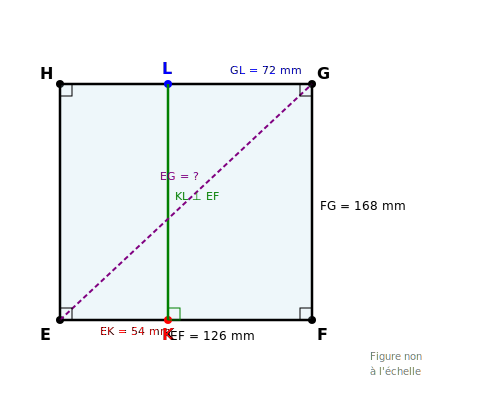
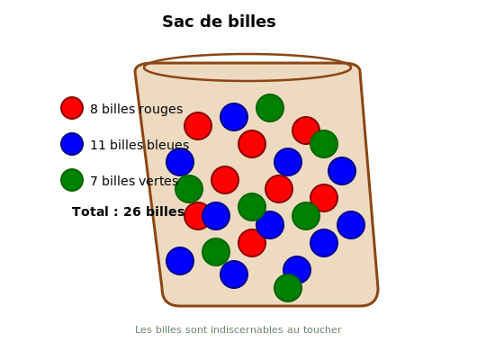
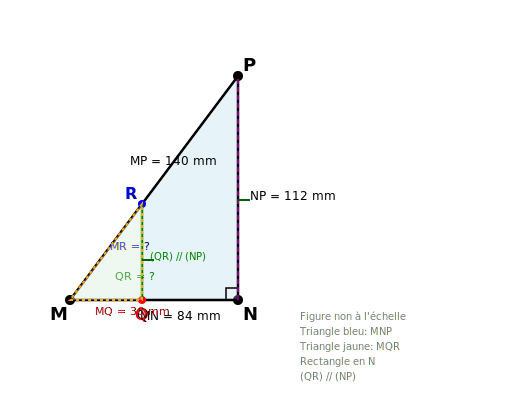

# Contrôle des connaissances de mathématiques
## Classes de 4ème - Examen 8 (NIVEAU DIFFICILE)

**Durée de l'épreuve : 2 heures**

*La calculatrice n'est pas autorisée.*
*La présentation devra être soignée et les résultats soulignés.*

---

## ALGÈBRE (10 points)

### Exercice 1 : Calcul numérique (4 points)

**1.** Calculer A et B et donner chaque résultat sous forme de fraction irréductible :

$$A = \frac{13}{34} + \frac{7}{51} - \frac{5}{68} \times \frac{24}{35}$$

$$B = \left(\frac{11}{26} - \frac{9}{52}\right) : \frac{-39}{104} + \frac{4}{13}$$

**2.** Calculer C et donner le résultat sous forme d'une puissance de 3 :

$$C = \frac{(3^{-4})^2 \times 3^{13} \times (3^3)^{-3}}{3^{-7} \times (3^{-1})^{-4}}$$

**3.** Donner l'écriture scientifique :

$$D = \frac{7,5 \times (10^{-3})^3 \times 4,8 \times 10^{15}}{1,2 \times 10^{-11} \times 6 \times 10^{-5}}$$

---

### Exercice 2 : Calcul littéral (3 points)

**a)** Développer et réduire :

$$E = (4x + 3)^2 - (5x - 2)(3x + 7) + (2x - 1)^2$$

**b)** Factoriser au maximum :

$$F = (3x + 8)(7x - 5) + (7x - 5)(2x - 9)$$

$$G = (6x - 7)^2 - 81$$

$$H = 4x^2 - 36x + 81$$

**c)** Soit $K = 16x^2 - 24xy + 9y^2$. Factoriser K puis calculer K pour $x = \frac{5}{8}$ et $y = \frac{2}{3}$.

---

### Exercice 3 : Système d'équations à deux inconnues (3 points)

Une bibliothèque municipale organise une vente de livres d'occasion. Les romans sont vendus 5 € l'unité et les bandes dessinées 3 € l'unité.

À la fin de la journée, le bibliothécaire constate qu'il a vendu 156 livres pour un montant total de 624 €.

**1.** En notant $x$ le nombre de romans vendus et $y$ le nombre de bandes dessinées vendues, écrire un système de deux équations à deux inconnues traduisant cette situation.

**2.** Résoudre ce système et déterminer le nombre de romans et le nombre de bandes dessinées vendus.

---

## GÉOMÉTRIE (10 points)

### Exercice 4 : Théorème de Pythagore (3,5 points)

Sur la figure ci-dessous, EFGH est un rectangle tel que EF = 126 mm et FG = 168 mm.
Le point K est sur [EF] tel que EK = 54 mm.
Le point L est sur [GH] tel que GL = 72 mm.

**1.** Calculer EG.

**2.** Calculer KL sachant que (KL) est perpendiculaire à (EF).

**3.** Les points E, K et L sont-ils alignés avec G ? Justifier.

**4.** Calculer l'aire du triangle EKL.

---

### Exercice 5 : Probabilités (3,5 points)

Un sac contient 26 billes indiscernables au toucher : 8 billes rouges, 11 billes bleues et 7 billes vertes.
On tire une bille au hasard dans le sac.

**1.** Quelle est la probabilité de tirer une bille rouge ? Donner le résultat sous forme de fraction irréductible.

**2.** Quelle est la probabilité de tirer une bille qui n'est pas verte ?

**3.** On effectue maintenant deux tirages successifs sans remise. Quelle est la probabilité de tirer deux billes rouges ?

---

### Exercice 6 : Aires et proportionnalité (3 points)

Sur la figure ci-dessous, MNP est un triangle tel que MN = 84 mm, NP = 112 mm et MP = 140 mm.
Le point Q est sur [MN] tel que MQ = 36 mm.
La droite parallèle à (NP) passant par Q coupe [MP] en R.

**1.** Le triangle MNP est-il rectangle ? Justifier.

**2.** Calculer QR.

**3.** Calculer MR.

**4.** Calculer le rapport des aires des triangles MQR et MNP.
