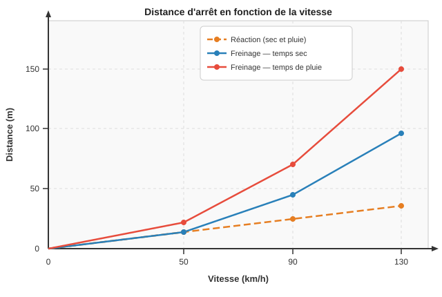

# Série de révision — Physique-Chimie 4ème

**Matière** : Physique-Chimie
**Chapitre** : Révision générale
**Date** : 29 avril 2026

---

## Exercice 1 — Les combustions

La combustion du méthane (CH₄) est utilisée dans les cuisinières à gaz.

1. Quels sont les réactifs de cette combustion ?
2. S'agit-il d'une combustion complète ou incomplète ? Justifie.
3. Nomme les produits formés.
4. Écris l'équation de réaction (non équilibrée) :
   `CH₄ + O₂ → ??? + ???`

---

## Exercice 2 — Combustion incomplète

Dans un garage fermé, une voiture tourne au ralenti. Un détecteur signale la présence de monoxyde de carbone (CO).

1. Ce phénomène correspond-il à une combustion complète ou incomplète ? Justifie.
2. Pourquoi le monoxyde de carbone est-il dangereux ?
3. Cite deux autres produits qui peuvent être formés lors d'une combustion incomplète.
4. Quelle est la cause de ce type de combustion ?

---

## Exercice 3 — Masse volumique : calculer ρ

Un bloc de bois a une masse de 450 g et occupe un volume de 600 cm³.

**Données** : ρ_eau = 1 g/cm³

1. Rappelle la formule de la masse volumique.
2. Calcule la masse volumique du bloc de bois. Donne l'unité.
3. Ce bloc flottera-t-il sur l'eau ? Justifie ta réponse.

---

## Exercice 4 — Masse volumique : calculer V

Un bijoutier possède un lingot d'or de masse 500 g.

**Données** : ρ_or = 19,3 g/cm³

1. Quelle grandeur doit-on calculer ? Écris la formule correspondante.
2. Calcule le volume du lingot. Donne l'unité.
3. Ce volume est-il plus grand ou plus petit qu'une cannette de 33 cL ? Justifie.

---

## Exercice 5 — Masse volumique : calculer m

Un aquarium rectangulaire a les dimensions suivantes : longueur 60 cm, largeur 30 cm, hauteur 40 cm. Il est rempli d'eau aux trois quarts.

**Données** : ρ_eau = 1 g/cm³ = 1 kg/L ; 1 L = 1 000 cm³

1. Calcule le volume total de l'aquarium en cm³.
2. Calcule le volume d'eau contenu dans l'aquarium en cm³, puis en litres.
3. Calcule la masse d'eau. Exprime le résultat en kg.

---

## Exercice 6 — Vitesse : conversions

1. Convertis les vitesses suivantes en m/s :
   - a) 90 km/h
   - b) 50 km/h
   - c) 130 km/h

2. Convertis les vitesses suivantes en km/h :
   - a) 25 m/s
   - b) 10 m/s
   - c) 36 m/s

---

## Exercice 7 — Distance d'arrêt

Le graphique ci-dessous représente les distances de réaction et de freinage en fonction de la vitesse, par temps sec et par temps de pluie.

**Données à lire sur le graphique :**

| Vitesse | Réaction | Freinage sec | Freinage pluie |
|---|---|---|---|
| 50 km/h | 14 m | 14 m | 22 m |
| 90 km/h | 25 m | 45 m | 70 m |
| 130 km/h | 36 m | 96 m | 150 m |

1. Explique la différence entre distance de réaction et distance de freinage.
2. Pourquoi la distance de réaction est-elle identique par temps sec et par temps de pluie ?
3. À 90 km/h, calcule la distance d'arrêt totale par temps sec.
4. À 90 km/h, calcule la distance d'arrêt totale par temps de pluie.
5. Quelle est la différence entre les deux ? Que peut-on en conclure ?

---

## Exercice 8 — Composition de l'air

**Partie A — Complète le tableau**

| Gaz | Formule | Pourcentage (%) |
|---|---|---|
| ??? | N₂ | ??? |
| Dioxygène | ??? | ??? |
| Argon | ??? | ≈ 1 % |
| ??? | CO₂ | ??? |

**Partie B — Vrai ou Faux ? Justifie chaque réponse.**

1. L'air est un corps pur.
2. Le dioxygène est le gaz le plus abondant dans l'air.
3. Le diazote est indispensable à la combustion.
4. L'air contient de la vapeur d'eau en quantité variable.
5. Le dioxyde de carbone représente environ 21 % de l'air.

---

## Exercice 9 — Équilibrage d'équations

Équilibre les équations de réaction suivantes en ajustant uniquement les coefficients (ne modifie pas les formules des molécules) :

1. `H₂ + O₂ → H₂O`

2. `CH₄ + O₂ → CO₂ + H₂O`

3. `Al + O₂ → Al₂O₃`

Pour chaque équation, vérifie ton résultat en comptant le nombre d'atomes de chaque côté.

---

## Exercice 10 — Bilan de transformation

On réalise la combustion complète du carbone (C) dans le dioxygène. La réaction produit du dioxyde de carbone (CO₂). On mesure les masses suivantes :

**Données** :
- Masse de carbone utilisée : 12 g
- Masse de dioxygène consommée : 32 g
- Masse de dioxyde de carbone produite : à calculer

1. Identifie les réactifs et les produits de cette réaction.
2. Écris le bilan de transformation sous la forme : réactifs → produits.
3. Applique la loi de Lavoisier pour calculer la masse de CO₂ produite.
4. Équilibre l'équation de réaction : `C + O₂ → CO₂`
5. Cette équation est-elle cohérente avec tes résultats ? Justifie.
